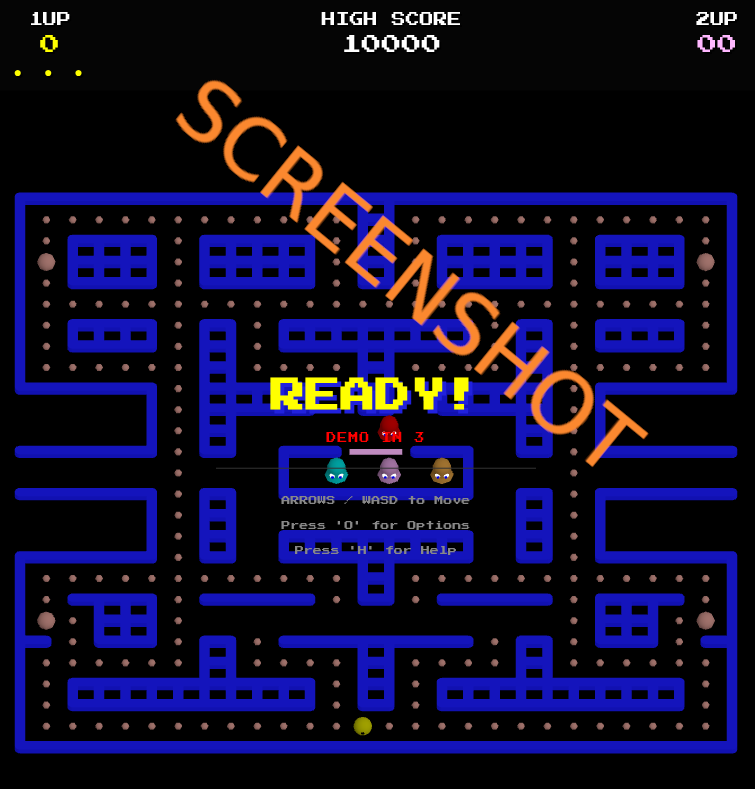

# js_manpac

# 3D GhostMan: 2-Player Arcade Edition

A browser-based **3D GhostMan** game built with **Three.js (ES Modules)**, featuring an isometric view, classic arcade mechanics, synthesized audio, and optional **2-player shared-screen gameplay**.

Inspired by the original arcade game, this project recreates the maze, pellets, ghosts, modes (Scatter / Chase / Frightened), and scoring, while presenting everything in a lightweight 3D style.


## Play it now: https://pemmyz.github.io/js_manpac/
---


## Screenshots

### Game



## Features

- 🎮 **1 Player & 2 Player modes**
- 🟡 Player 1: Classic GhostMan
- 🌸 Player 2: Ms. GhostMan style character
- 👻 Four ghosts with distinct behaviors (Binky, Rinky, Dinky, Claid)
- 🧠 Authentic ghost modes:
  - Scatter
  - Chase
  - Frightened
  - Eaten / Return-to-home
- 🍒 Pellets & Power Pellets
- 🔊 Procedural audio using Web Audio API (no external sound files)
- 🧱 Fully 3D maze with arcade-inspired visuals
- 🖥 Deterministic fixed-timestep game loop (60 Hz)
- 🌐 Runs entirely in the browser (no build step)

---

## Controls

### Player 1
- **Arrow Keys** – Move

### Player 2
- **W A S D** – Move

### Menu
- **Arrow Up / Down** or **W / S** – Toggle 1P / 2P
- **Space / Enter** – Start game
- **Space / Enter** – Restart after Game Over

---

## How to Run

Because this project uses **ES Modules**, it must be served from a local web server.

### Option 1: Using Python (recommended)

From the project folder:

```bash
python3 -m http.server 8000
```

Then open your browser and go to:

```
http://localhost:8000
```

### Option 2: VS Code Live Server

- Install the **Live Server** extension
- Right-click `index.html`
- Select **Open with Live Server**

---

## Project Structure

```
/
├── index.html     # Main HTML file
├── style.css      # UI & arcade-style HUD
├── script.js      # Game logic (Three.js, gameplay, AI)
└── README.md      # This file
```

---

## Tech Stack

- **JavaScript (ES6 Modules)**
- **Three.js r160**
- **Web Audio API**
- **HTML5 / CSS3**
- No frameworks, no bundlers

---

## Gameplay Notes

- Ghost behavior closely follows classic GhostMan rules offering familiar yet dynamic gameplay
- Tunnel wraparound works on the center row
- Power pellets temporarily reverse ghost behavior
- In 2-player mode, ghosts target the nearest active player
- Shared maze and shared pellets encourage cooperative or competitive play

---

## 📜 License

This project is released under the **MIT License**.  
You are free to use, modify, and distribute it.

This is a **fan-made, non-commercial project**.

---

Enjoy the game! 👾
